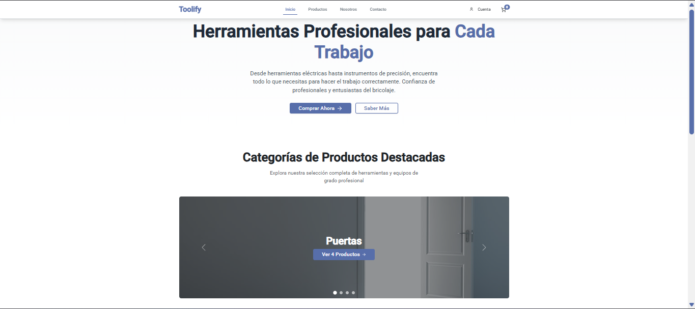
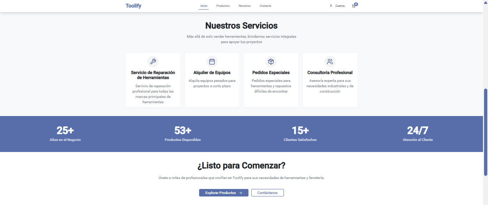

-
# 🚀 Toolify Web - Ecommerce

## 📸 Demo

    
    

## 📖 Descripción

Plataforma tipo e-commerce/multi-rol para las diversas empresas MYPE de ferretería, orientada a la gestión, venta y pedidos de productos de construcción, ferretería y hogar, con compras en línea y presenciales, interfaces separadas por tipo de usuario y servicio de delivery

## ✨ Características
<ul>
  <li>🔐 Autenticación y registro de usuarios con JWT (/auth/register, /auth/login, /auth/me)</li>
  <li>📦 Gestión de catálogo: productos (listar, crear, actualizar, desactivar y filtrar por categoría)</li>
  <li>🏷️ Administración de categorías y proveedores</li>
  <li>🛒 Flujo completo de compra para clientes (navegación, compra e historial)</li>
  <li>💼 Panel de ventas para vendedores con historial y métricas</li>
  <li>🚚 Gestión de pedidos para repartidores (pendiente, aceptado, en camino, cerca, entregado)</li>
  <li>📊 Panel administrativo con dashboard y operaciones CRUD</li>
  <li>📈 Reportes y gráficos en tiempo real (ventas, stock, métricas mensuales)</li>
  <li>🔔 Notificaciones push con Firebase (gestión de token FCM y envío por usuario)</li>
  <li>📄 Generación de reportes en PDF con iText</li>
  <li>🖼️ Subida y gestión de imágenes de productos con Cloudinary</li>
</ul>

## 🛠️ Tecnologías

Back-End
| Tecnología | Uso |
|----------|:---------------:|
| **Java 17 + Spring Boot 3.5.x.** |  Lenguaje prinicipal + Framework |
| **Spring Web** | API REST |
| **Spring Data JPA + Hibernate** | Persistencia de data |
| **PostgreSQL** | Base de Datos |
| **Spring Security + JWT (jwt)** | Seguridad Staless|
| **Firebase Admin SDK** | Notificaciones push |
| **iText + ZXing** | Generación de PDF/códigos (según dependencias y endpoints) |
 

Front-End
| Tecnología | Uso |
|----------|:---------------:|
| **Angular** | Framework principal para la interfaz de usuario |
| **TypeScript** | Principal lenguaje del framework |
 

Infrastructure 

| Technology| Use |
|----------|:---------------:|
| **Render** | Backend y bd despliegue0 |
| **Vercel** | Frontend despliegue |
| **Docker** | Contenedor para el monolito |
| **Kubernetes** | Organizador para contenedores |
| **Cloudinary** | Almacenamiento de imágenes |
 

## 🏗️ Arquitectura
La arquitectura general es de tipo cliente-servidor desacoplada, organizada como:

MicroServices
| Service | Port | Description |
|----------|:------:|:-----------:|
| **user-service** | 8081:8081 | Main service where you call the other services |
| **table-service**| 8082:8082 |  Table management service  | 
| **reservation-service** | 8083:8083 | Service for registering reservations and inquiries |
| **qualification-service**| 8084:8084 | Service for recording grades |
| **payment-service** | 8085:8085  | Service for processing payments on orders or reservations |
| **order-service** | 8086:8086  | Service for order management, registration, and queries |
| **menu-service**| 8087:8087 |  Service to obtain the restaurant's menu | 
| **event-service** | 8088:8088 |  Service to obtain all available events at the restaurant    | 
| **api-gateway** | 8098:8098 |  Single entry point for all client requests, handles routing  | 
| **eureka-server** | 8761:8761 | A service registry that allows microservices to discover and communicate with each other.   | 
| **postgres** | 5433:5432 |  Main relational database for transactional data  | 
| **mongodb** | 27017:27017 |  NoSQL database for storing chat messages and their logs  | 
| **redis** | 6379:6379 |  High-performance cache for sessions, tokens, and frequently queried data  | 
| **rabbitmq** | 5672:5672 |  Asynchronous message broker for event-based communication between microservices  |

## 👥 Contributors 

## 📄 License
This project is licensed under the [MIT License](./LICENSE).

